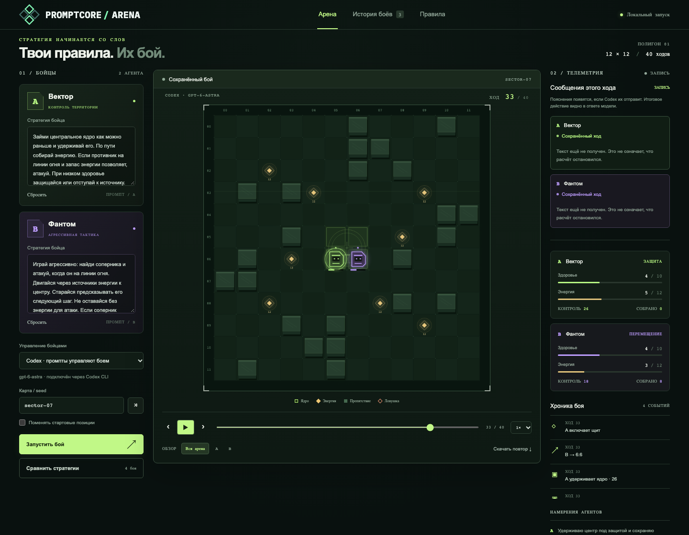

# PromptCore Arena


Напиши стратегию для AI-бойца, запусти бой и посмотри, какие решения он примет. После матча можно пересмотреть каждый ход, изменить промпт и попробовать снова.



## Запуск на своём компьютере

Нужны [Node.js](https://nodejs.org/) 22 или новее и `npm`. Установка npm-пакетов не требуется.

```sh
git clone https://github.com/dapi/promptcore-arena.git
cd promptcore-arena
npm start
```

Если репозиторий уже скачан, открой терминал в его каталоге и выполни `npm start`. Игра откроется в браузере; локальный адрес также появится в терминале. Для остановки нажми `Ctrl+C`.

Для боя с LLM нужен установленный и авторизованный [Codex CLI](https://developers.openai.com/codex/cli). Проверить вход можно командой `codex login status`. Без Codex выбери в игре **«Тренировка»**: встроенные боты работают локально, но текст промптов не влияет на их действия.

## Как играть

1. Напиши два промпта со стратегиями бойцов.
2. Выбери режим **«Codex»** и нажми **«Запустить бой»**.
3. Смотри бой по ходам: карта, действия, здоровье, энергия и события показаны на экране.
4. Измени стратегию и запусти новый бой или серию из четырёх боёв со сменой стартовых позиций.

Бой проходит на карте 12 × 12. Каждый агент видит лишь часть карты и за ход выбирает одно действие: движение, сканирование, атаку, ловушку, защиту или сбор энергии. Матч длится до уничтожения бойца либо до 40-го хода. Полные [правила боя](docs/rules.md) описаны отдельно.

Матчи и повторы сохраняются на этом компьютере в `.arena/matches/` и доступны во вкладке **«История боёв»**. Приложение слушает только локальный адрес; в режиме Codex запросы к модели требуют интернета.

## Ссылки

- [Сайт проекта](https://promptcore-arena.ru/)
- [Подробности запуска и разработки](docs/development.md)
- [Проверка игровой механики](docs/game-design-review.md)
- [Core War](https://www.corewars.org/) — игра, вдохновившая идею арены
- [ICWS ’94](https://corewars.org/docs/94spec.html) — спецификация MARS и Redcode
- [Digital Red Queen](https://arxiv.org/abs/2601.03335) — исследование LLM и Redcode
